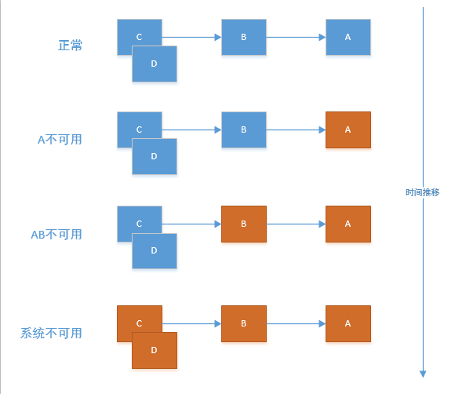

## 1 springcloud

### 1.1 Spring Cloud概述

Spring Cloud是一个基于Spring Boot实现的微服务开发架构，它利用Spring Boot的开发便利性巧妙地简化了分布式系统的开发。例如配置管理、服务发现、断路器、智能路由、控制总线等操作，都可以使用Spring Boot开发风格做到一键启动和部署。可以说，Spring Cloud将Spring Boot风格进行再封装,屏蔽掉了复杂的配置和实现原理，最终给开发者留出了一套简单易懂、易部署和易维护的分布式系统开发工具包。

Spring Cloud之所以是当下最流行的微服务架构，具有以下特点：

1. 组件丰富，功能齐全

Spring Cloud拥有Spring的强大后盾，框架的源码也是开源的，开发者不断完善Spring Cloud下的组件，其中包括Spring Cloud Eureka注册发现中心，主要负责完成微服务架构中的服务治理功能；Spring Cloud Config分布式配置中心，可以实现动态修改配置文件；Spring Cloud Hystrix熔断器，通过熔断机制控制服务和第三方库的节点，从而对延迟和故障提供更强大的容错能力，这些组件基本包括了日常开发的各个方面。

2. 开箱即用，快速启动

Spring Cloud是基于Spring Boot开发的，Spring Boot具有快速构建Spring应用、直接嵌入服务器、自动化配置的优点，Spring Cloud继承了Spring Boot快速构建和自动化配置的优点，有开箱即用，快速启动的特点。

3. 模块部署方便，项目维护难度降低

Spring Cloud采用模块化开发，按照项目功能，将项目拆分为不同的模块，每个模块独立开发运行，模块之间不会互相影响。模块开发完成后，每个模块部署时可以使用Docker自动化部署，使得项目部署更加方便。维护时只需要维护具体的模块，不需要改动其他模块的代码，从而降低模块后期维护的成本。

4. 项目扩展性和稳定性较好

基于Spring Cloud的微服务架构中，每个模块基本都是一个Spring Boot项目，它们都有独立的数据库，模块下的功能是横向开发的，如果需要扩展新的功能，可以新建该功能对应的独立数据库以及新的模块，不需要在之前的模块上修改，项目扩展更方便，项目稳定性更好。

5. 具有容错处理机制。

实际开发中会因为网络连接失败、超时、服务器硬件故障等原因导致其中某个模块无法正常运行，导致整个项目发生异常，所以容错机制变得尤为重要。在Spring Cloud中提供了Hystrix组件，该组件专门用于处理容错，从而能保证某个模块出错后有其他备用模块或者善后处理。

### 1.2 Spring Cloud微服务架构的组件

Spring Cloud是一系列框架的有序集合，为开发人员构建微服务架构提供了完整的解决方案，它利用Spring Boot开发的便利性巧妙地简化了分布式系统基础设施的开发，如服务注册发现、配置中心、消息总线、负载均衡、断路器、数据监控等，都可以用Spring Boot的开发风格做到一键启动和部署，下面我们讲解一下Spring Cloud包含的常用组件以及模块。

（1）Spring Cloud Config：配置管理工具包，负责把配置放到远程服务器，集中化管理集群配置，目前支持本地存储、Git以及Subversion。

（2）Spring Cloud Netflix：核心组件，负责对多个Netflix OSS开源套件进行整合。

- Eureka：服务注册中心，基于REST服务的分布式中间件，主要用于服务管理。

- Hystrix：熔断器，容错管理工具，旨在通过熔断机制控制服务和第三方库的节点,从而对延迟和故障提供更强大的容错能力。

- Ribbon：云端负载均衡，支持多种负载均衡策略，可配合服务发现和断路器使用，在客户端实现负载均衡。

- Feign：一个REST客户端，基于Ribbon和Hystrix的声明式服务调用组件。

- Zuul：服务网关，为微服务集群提供代理，过滤，路由等功能。

（3）Spring Cloud Bus：事件、消息总线，用于在集群（例如配置变化事件）中传播状态变化，可与Spring Cloud Config联合实现热部署。

（4）Spring Cloud Stream：数据流操作开发包，封装了与Redis、RabbitMQ、Kafka等发送接收消息。

（5）Spring Cloud Sleuth：服务追踪框架，可以与Zipkin、Apache Htrace和ELK等数据分析，服务跟踪系统进行整合，为服务跟踪、解决问题提供了便利。

下面看一个基于Spring Cloud的微服务架构图


### 1.3 Spring Cloud版本号

Spring Cloud在Spring团队和世界各国程序员一年多的努力下，其版本以及各个组件的版本已经大致有7个，Spring Cloud版本号并不是熟悉的数字版本号，而是一个名称代号，这些代号据说是根据伦敦地铁命名的，分别是Angel、Brixton、Camden、Dalston、Edgware、Finchley，Greenwich，其中Angel版本是第一个Release版本，Greenwich是截稿时最新的稳定版本。

Spring Cloud的版本名称，通常是由“版本号+小版本名称”组成的。这样设计的目的是为了更好地管理每个Spring Cloud子项目的清单，避免自己的版本号与子项目的版本号混淆。例如，Finchley M1版本中，Finchley代表的是版本号，M1是小版本名称，在Spring Cloud的版本中，每个版本里面包含很多小版本，这些小版本使用不同的标识符号来表示版本的状态，常见的版本标识号具体如下：

（1） SNAPSHOT：快照版本，可能会被修改。

（2） M：MileStone的简称，M1表示第一个里程碑版本，一般同时标注PRE，表示预览版本。

（3） SR：Service Release的简称，表示正式版本。如果正式版有多个，使用数字标识不同的正式版本，例如SR1表示第一个正式版本，同时一般会标注GA：（GenerallyAvailable），表示稳定版本。

​    需要说明的是，Spring Cloud各个版本之间的组件变化不会很大，只有一些细节略有不同，例如配置项名称、新版本增加的新配置方式等。日常开发选择组件版本时最好根据Spring Cloud版本查询对应组件，否则很有可能会导致版本不匹配。也就是说，选择Spring Cloud版本与各个组件版本时要以兼容为第一要务。


### 1.4 Spring Cloud与Spring Boot的兼容性

通过前面的学习，大家应该知道Spring Cloud是基于Spring Boot开发的。Spring Boot专注于快速、方便集成单个微服务，而Spring Cloud是关注全局的服务治理框架，Spring Cloud依赖于Spring Boot。

由于Spring Cloud和Spring Boot都发布了多个版本，选择这些版本时需要考虑兼容性。接下来，通过一张表描述Spring Cloud与Spring Boot版本的匹配关系

Spring Cloud与Spring Boot版本的匹配关系

| Spring Cloud版本     | Spring Boot版本      |
| -------------------- | -------------------- |
| Greenwich版本        | 兼容Spring Boot2.1.x |
| Finchley版本         | 兼容Spring Boot2.0.x |
| Dalston和Edgware版本 | 兼容Spring Boot1.5.x |
| Camden版本           | 兼容Spring Boot1.4.x |
| Brixton版本          | 兼容Spring Boot1.3.x |
| Angel版本            | 兼容Spring Boot1.2.x |

## 2.Eureka服务注册与发现

### 2.1 Eureka介绍及原理

#### 2.1.1 理解

Eureka就像一个物业管理公司，其他微服务就像小区的住户，每个住户入住时都要向物业管理公司注册，并定
时向物业公司交管理费

#### 2.1.2 介绍

- Eureka是一个Netflix公司基于REST的服务，用于定位服务，以实现云端中间层服务发现和故障转移。
- Eureka主管服务注册与发现，在微服务中，以后了这两者，只需要使用服务的标识符（就是那个在每个服
  务的yml文件中取得服务名称），就可以访问到服务，不需要修改服务调用的配置文件
- Eureka遵循AP原则（高可用，分区容错性），因为使用了自我保护机制所以保证了高可用

#### 2.1.3 原理

- Eureka使用的是C-S结构（客户端-服务端）
- 两大组件：Eureka Server（提供注册服务）、 Eureka Client（JAVA客户端，负责发送心跳）
- 系统中的其他微服务使用Eureka客户端连接到Eureka服务端维持心跳连接（即注册）。SpringCloud的其
  他模块可以通过Eureka Server 来发现系统中的微服务并加以调用
- 在应用启动后，将会向Eureka Server发送心跳,默认周期为30秒，如果Eureka Server在多个心跳周期内没
  有接收到某个节点的心跳，Eureka Server将会从服务注册表中把这个服务节点移除(默认90秒)。


### 2.2 Eureka服务注册中心构建

创建工程 heima-leadnews-eureka
Eureka Server 提供服务注册和发现
Provider服务提供方将自身服务注册到Eureka，从而使服务消费方能够找到
Consumer服务消费方从Eureka获取注册服务列表，从而能够消费服务

#### 2.2.1 加入服务端依赖

```xml
<dependencies>
    <dependency>
        <groupId>org.springframework.cloud</groupId>
        <artifactId>spring-cloud-starter-netflix-eureka-server</artifactId>
    </dependency>
</dependencies>
```

#### 2.2.2 配置yml

理解：物业公司肯定不向自己注册自己，并肯定知道自己在哪，不用参加检索

```yaml
server:
  port: 8761
eureka:
  instance:
    hostname: localhost
  client:
    register-with-eureka: false  #false表示不向注册中心注册自己
    fetch-registry: false  #false表示自己就是注册中心，职责是维护实例，不参与检索
    service-url:
      #设置eurekaservice的交互地址，即对外暴露的地址
      defaultZone: http://${eureka.instance.hostname}:${server.port}/eureka/
```


#### 2.2.3 添加启动类

注意：要在类前加@EnableEurekaServer标注

```java
package com.heima.eureka;

import org.springframework.boot.SpringApplication;
import org.springframework.boot.autoconfigure.SpringBootApplication;
import org.springframework.cloud.netflix.eureka.server.EnableEurekaServer;

@SpringBootApplication
@EnableEurekaServer   //EurekaServer服务器端启动类,接受其它微服务注册进来
public class EurekaApplication {

    public static void main(String[] args) {
        SpringApplication.run(EurekaApplication.class,args);
    }
}
```

验证是否构建成功
启动主程序，访问该服务地址即可http://localhost:8761/


### 2.3 向Eureka注册中心注册微服务

heima-leadnews-wemedia和heima-leadnews-article服务提供方将自身服务注册到Eureka Server中，从而使服务消费方能够找到

#### 2.3.1 增加依赖

```xml
<!--eureka-->
<dependency>
    <groupId>org.springframework.cloud</groupId>
    <artifactId>spring-cloud-starter-netflix-eureka-client</artifactId>
</dependency>
```

#### 2.3.2 修改yml

```yaml
eureka:
  client:
    service-url:
      defaultZone: http://localhost:8761/eureka
```


#### 2.3.3 主启动类增加注解

增加@EnableEurekaClient注解

```java
@SpringBootApplication
@EnableEurekaClient
@MapperScan("com.heima.wemedia.mapper")
public class WemediaApplication {

    public static void main(String[] args) {
        SpringApplication.run(WemediaApplication.class,args);
    }
}
```

### 2.4 Eureka的自我保护

#### 2.4.1 介绍

Eureka的自我保护机制主要是为了网络异常时保持高可用设计的，当在Eureka中注册的微服务超过设定是时间
内（默认90秒）没有向Eureka服务端发送心跳，该微服务会进入自我保护模式。在自我保护模式中，Eureka会保护服务注册表中的信息，不会注销任何服务实例，直至收到的心跳数恢复至阈值以上，该微服务退出自我保护模式。

#### 2.4.2 理解

好死不如赖活：Eureka的设计哲学是宁可保留错误的服务信息，也不盲目注销可能健康的服务。所以异常的服
务不会被注销，而是进入了自我保护模式。

#### 2.4.3 自我保护模式的开关

在Eureka Server模块下的yml文件中添加配置信息即可，true表示打开自我保护模式；false表示关闭自我保护
模式（不推荐）

```yaml
eureka:
  server:
    enable-self-preservation: false  #关闭自我保护
```

### 2.5 Eureka的集群配置

集群就是在不同的机器上配置相同的服务来构建要一个大的运算整体Eureka Server 高可用环境需要部署两个Eureka server，它们互相向对方注册。如果在本机启动两个Eureka需要注意两个Eureka Server的端口要设置不一样，这里我们部署一个Eureka Server工程，将端口可配置，制作两个Eureka Server启动脚本，启动不同的端口，如下图：

1、在实际使用时Eureka Server至少部署两台服务器，实现高可用。部署三台

2、三台Eureka Server互相注册。

3、微服务需要连接三台Eureka Server注册，当其中一台Eureka死掉也不会影响服务的注册与发现。

4、微服务会定时向Eureka server发送心跳，报告自己的状态。

5、微服务从注册中心获取服务地址以RESTful方式发起远程调用。

#### 2.5.1 实现集群

1. 新建3个Eureka Server模块

2. 每个模块的pom.xml中加入与单个Eureka Server相同的依赖

3. 每个模块加入主程序（记得加@EnableEurekaServer注解）

4. 修改hosts文件（Win7的路径是C:\Windows\System32\drivers\etc）

   ```java
   127.0.0.1 eureka01
   127.0.0.1 eureka02
   127.0.0.1 eureka03
   ```

5. 修改Eureka Server模块的application.yml文件，加入集群，主要修改两个地方：

   - hostname：修改为hosts文件中映射的地址
   - service-url下的defaultZone节点：填入集群中另外的server服务端的地址
   - 以下是8761的application.yml文件的配置

   ```yaml
   server:
     port: 8761
   eureka:
     instance:
       hostname: ${EUREKA-DOMAIN:eureka01}
     client:
       register-with-eureka: false  #false表示不向注册中心注册自己
       fetch-registry: false  #false表示自己就是注册中心，职责是维护实例，不参与检索
       service-url:
         #设置eurekaservice的交互地址，即对外暴露的地址
         #defaultZone: http://${eureka.instance.hostname}:${server.port}/eureka/
         defaultZone: http://eureka02:8762/eureka/,http://eureka03:8763/eureka/
     server:
       enable-self-preservation: false  #关闭自我保护
   ```

6. 修改客户端模块(heima-leadnews-article)的application.yml文件，使其向集群注册服务

   ```yaml
   eureka:
     client:
       service-url:
         defaultZone: http://eureka02:8761/eureka,http://eureka01:8762/eureka,http://eureka01:8763/eureka
   ```

7. 修改consumer模块(heima-leadnews-wemedia)的application.yml文件，使其向集群服务发现

   ```yaml
   eureka:
     client:
       service-url:
         defaultZone: http://eureka02:8761/eureka,http://eureka01:8762/eureka,http://eureka01:8763/eureka
   ```

   

8. eureka服务地址

   ```html
   http://eureka01:8761
   http://eureka02:8762
   http://eureka03:8763
   ```

9. **注：defaultZone中eureka/后缀是必须的，如果删除，Server类不会报错，但是Client注册时会报404错**
   **误**


#### 2.5.2 Eureka与Zookeeper对比【面试】


**CAP + BASE 是学习当前知识的前提**


#### 2.5.3 网络波动下两者的处理对比

| Zookeeper                                                    | Eureka                                                       |
| :----------------------------------------------------------- | ------------------------------------------------------------ |
| 当网络出现故障时，剩余zk集群会发起投票选举新的leader，但是此过程会持续30~120s，此过程对于高并发来说十分漫长，会导致整个注册服务的瘫痪，这是不可容忍的 | 端与之出现了网络故障，则会进入自动保护模式。1.Eureka不会移除没有收到心跳的服务；2.新的服务仍能在服务端注册，但是暂时不会被同步到其他节点上直到网络稳定 |

Eureka可以很好的应对网络故障导致部分节点失去连接的情况，而不会像zookeeper那样导致整个注册服务系统
的瘫痪。

## 3.Ribbon负载均衡

Spring Cloud Ribbon是基于Netflix Ribbon实现的一套客户端负载均衡工具。Ribbon会自动帮助你基于某种规
则（简单轮询、随机连接等），也可以实现自定义的负载均衡算法。

### 3.1 负载均衡

英文名称：Load Balance，微服务或分布式集群中常用的一种应用
简单来说负载均衡就是将用户的请求ping平摊的分配到多个任务上，从而是系统达到HA（高可用）

什么是客户端负载均衡？

客户端负载均衡与服务端负载均衡的区别在于客户端要维护一份服务列表，Ribbon从
Eureka Server获取服务列表，Ribbon根据负载均衡算法直接请求到具体的微服务，中间省去了负载均衡服务。
如下图是Ribbon负载均衡的流程图


- 在消费微服务中使用Ribbon实现负载均衡，Ribbon先从EurekaServer中获取服务列表。
- Ribbon根据负载均衡的算法去调用微服务

#### 3.1.1 Ribbon客户端配置

Ribbon是客户端负载均衡工具！！！Ribbon是客户端负载均衡工具！！！Ribbon是客户端负载均衡工
具！！！所以应该配置在客户端

1. 在RestTemplate的配置方法上添加 @LoadBalanced 注解,引导类上加入@EnableEurekaClient

   

   

2. controller中调用方式

```java
@RestController
@RequestMapping("/wmnews")
public class WmNewsController {

    @Autowired
    private RestTemplate restTemplate;

    @GetMapping("/one/{id}")
    public ResponseResult getOne(@PathVariable("id") Integer id){
        ApArticle forObject = restTemplate.getForObject("http://ARTICLE/article/findOne/" + id, ApArticle.class);
        return ResponseResult.okResult(forObject);
    }

}
```


#### 3.1.2 Ribbon负载均衡测试实现

http://localhost:9001/wmnews/one/1连续刷新浏览器
总结
Ribbon其实就是一个软负载均衡的客户端组件，可以和其他需要请求的客户端结合使用。
默认情况下使用的是 轮询的算法 来访问 各个微服务的。
添加@LoadBalanced注解后，restTemplate会走LoadBalancerInterceptor拦截器，此拦截器中会通过
RibbonLoadBalancerClient根据serviceID（Eureka Server中 Application Name）查询服务地址，可以在此类打
断点观察每次调用的服务地址和端口，各个服务会轮流被调用。


## 4.Feign负载均衡【推荐】

Feign是一个声明式WebService客户端，使用方法时定义一个接口并在上面添加注解即可。Feign支持可拔插式
的编码器和解码器。Spring Cloud对Feign进行了封装，使其支持SpringMVC和HttpMessageConverters。Feign可以与Eureka和Ribbon组合使用以支持负载均衡。
Feign 是基于Ribbon负载均衡的实现，Feign对Ribbon进行了封装。


### 4.1 案例实现

因为Feign开发其实是面向接口编程，所以Feign接口可以放在api模块中供各模块使用，所以要在api模块中
添加Feign依赖

```xml
 <dependency>
     <groupId>org.springframework.cloud</groupId>
     <artifactId>spring-cloud-starter-openfeign</artifactId>
</dependency>
```

在heima-leadnews-wemedia模块中，新增接口com.heima.wemedia.feign.ApArticleFeign

```java
package com.heima.wemedia.feign;

import com.heima.model.article.pojos.ApArticle;
import org.springframework.cloud.openfeign.FeignClient;
import org.springframework.web.bind.annotation.GetMapping;
import org.springframework.web.bind.annotation.PathVariable;

@FeignClient("ARTICLE")
public interface ApArticleFeign {

   @GetMapping("/article/findOne/{id}")
   public ApArticle findOne(@PathVariable("id") Integer id);
}
```

- 首先这是一个接口，Feign会通过动态代理，帮我们生成实现类。这点跟mybatis的mapper很像
- @FeignClient ，声明这是一个Feign客户端，同时通过 value 属性指定服务名称
- 接口中的定义方法，完全采用SpringMVC的注解，Feign会根据注解帮我们生成URL，并访问获取结果
- @GetMapping中的/article，请不要忘记；因为Feign需要拼接可访问的地址


修改com.itheima.consumer.controller.DeptController

```java
@Autowired
private ApArticleFeign articleFeign;

@GetMapping("findOne/{id}")
public ResponseResult findArticleById(@PathVariable("id") Integer id){
    ApArticle article = articleFeign.findOne(id);
    return ResponseResult.okResult(article);
}
```

开启Feign功能


启动后访问http://localhost:9001/wmnews/one/1，即会按照轮询的方式调用provider集群

### 4.2 总结

- Feign通过接口方法调用REST服务，在Eureka中查找对应的服务 
- Feign集成了Ribbon技术，所以也支持负载均衡（轮询)
- 流程分析：【重要】

1. 由于我们在入口@EnableFeignClients注解，Spring启动后会扫描标注了@FeignClient注解的接口，
   然后生成代理类
2. 我们在@FeignClient接口中指定了value，其实就是指定了在Eureka中的服务名称serviceID
3. 在FeignClient中的定义方法以及使用了SpringMVC的注解，Feign就会根据注解中的内容生成对应的
   URL，然后基于Ribbon的负载均衡去调用REST服务
   a) 为什么使用的是SpringMVC的注解？
   其实，Feign是有自己的注解的，是因为Spring Cloud对Feign做了增强，兼容了SpringMVC的注解，使我
   们的学习成本更低。

## 5.Hystrix熔断器

### 5.1 分布式系统面临的问题

#### 5.1.1 扇出

多个微服务互相调用的时候，如果A调用B、C，而B、C又继续调用其他微服务，这就是扇出（像一把扇子一样
慢慢打开。

#### 5.1.2 服务雪崩

在微服务架构中通常会有多个服务层调用，大量的微服务通过网络进行通信，从而支撑起整个系统。各个微服务
之间也难免存在大量的依赖关系。然而任何服务都不是100%可用的，网络往往也是脆弱的，所以难免有些请求会失败。基础服务的故障导致级联故障，进而造成了整个系统的不可用，这种现象被称为服务雪崩效应。服务雪崩效应描述的是一种因服务提供者的不可用导致服务消费者的不可用，并将不可用逐渐放大的过程。
A作为服务提供者，B为A的服务消费者，C和D是B的服务消费者。A不可用引起了B的不可用，并将不可用像滚
雪球一样放大到C和D时，雪崩效应就形成了。



雪崩效应产生的几种场景

- 流量激增：比如异常流量、用户重试导致系统负载升高；
- 缓存刷新：假设A为client端，B为Server端，假设A系统请求都流向B系统，请求超出了B系统的承载能力，
  就会造成B系统崩溃；
- 程序有Bug：代码循环调用的逻辑问题，资源未释放引起的内存泄漏等问题；
- 硬件故障：比如宕机，机房断电，光纤被挖断等。
- 数据库严重瓶颈，比如：长事务、sql超时等。
- 线程同步等待：系统间经常采用同步服务调用模式，核心服务和非核心服务共用一个线程池和消息队列。
  如果一个核心业务线程调用非核心线程，这个非核心线程交由第三方系统完成，当第三方系统本身出现问
  题，导致核心线程阻塞，一直处于等待状态，而进程间的调用是有超时限制的，最终这条线程将断掉，也
  可能引发雪崩

#### 5.1.3 雪崩解决方案

#####  超时机制

通过网络请求其他服务时，都必须设置超时。正常情况下，一个远程调用一般在几十毫秒内就返回了。当依赖的
服务不可用，或者因为网络问题，响应时间将会变得很长（几十秒）。而通常情况下，一次远程调用对应了一个线
程/进程，如果响应太慢，那这个线程/进程就会得不到释放。而线程/进程都对应了系统资源，如果大量的线程/进程得不到释放，并且越积越多，服务资源就会被耗尽，从而导致资深服务不可用。所以必须为每个请求设置超时。

#####  断路器模式

试想一下，家庭里如果没有断路器，电流过载了（例如功率过大、短路等），电路不断开，电路就会升温，甚至
是烧断电路、起火。有了断路器之后，当电流过载时，会自动切断电路（跳闸），从而保护了整条电路与家庭的安
全。当电流过载的问题被解决后，只要将关闭断路器，电路就又可以工作了。
同样的道理，当依赖的服务有大量超时时，再让新的请求去访问已经没有太大意义，只会无谓的消耗现有资源。
譬如我们设置了超时时间为1秒，如果短时间内有大量的请求（譬如50个）在1秒内都得不到响应，就往往意味着异常。此时就没有必要让更多的请求去访问这个依赖了，我们应该使用断路器避免资源浪费。

断路器可以实现快速失败，如果它在一段时间内侦测到许多类似的错误（譬如超时），就会强迫其以后的多个调用快速失败，不再请求所依赖的服务，从而防止应用程序不断地尝试执行可能会失败的操作，这样应用程序可以继续
执行而不用等待修正错误，或者浪费CPU时间去等待长时间的超时。断路器也可以使应用程序能够诊断错误是否已经修正，如果已经修正，应用程序会再次尝试调用操作。
断路器模式就像是那些容易导致错误的操作的一种代理。这种代理能够记录最近调用发生错误的次数，然后决定
使用允许操作继续，或者立即返回错误。

### 5.2 Hystrix介绍

- Hystrix是一个用于处理分布式系统延迟和容错的开源库。分布式系统中，依赖避免不了调用失败，比如超
  时，异常等。Hystrix能保证在出现问题的时候，不会导致整体服务失败，避免级联故障，以提高分布式系
  统的弹性
- Hystrix就类似于 “断路器” 本身是一种开关装置，当某个服务单元发生故障之后，通过断路器的故障监控
  （类似熔断保险丝），向调用方返回一个符合预期的、可处理的备选响应（FallBack），而不是长时间的
  等待或者抛出调用方无法处理的异常，这样就保证了服务调用方的线程不会被长时间、不必要地占用，从
  而避免了故障在分布式系统中的蔓延，乃至雪崩

总结：Hystrix主要的作用就是：服务的熔断、服务降级、服务限流、近实时监控

### 5.3 服务降级实现

在heima-leadnews-wemedia模块中引入依赖

```xml
<dependency>
    <groupId>org.springframework.cloud</groupId>
    <artifactId>spring-cloud-starter-netflix-hystrix</artifactId>
</dependency>
```

开启熔断

在启动类上添加注解：@EnableCircuitBreaker

```java
@SpringBootApplication
@EnableEurekaClient
@EnableFeignClients
@EnableCircuitBreaker
@MapperScan("com.heima.wemedia.mapper")
public class WemediaApplication {
    //...
}
```


编写降级逻辑

当目标服务的调用出现故障，我们希望快速失败，给用户一个友好提示。因此需要提前编写好失败时的降级处理逻
辑，要使用HystrixCommand来完成。

改造 com.itheima.consumer.controller.DeptController 处理器类，如下：

```java
 @Autowired
private ApArticleFeign articleFeign;

@GetMapping("findOne/{id}")
//    @HystrixCommand(fallbackMethod = "queryByIdFallBack")
@HystrixCommand
public ResponseResult findArticleById(@PathVariable("id") Integer id){
    ApArticle article = articleFeign.findOne(id);
    return ResponseResult.okResult(article);
}

public ResponseResult defaultFallBack(){
    return ResponseResult.okResult(10001,"查询失败");
}
```

要注意；**因为熔断的降级逻辑方法必须跟正常逻辑方法保证：相同的参数列表和返回值声明。**

@HystrixCommand(fallbackMethod = "queryByIdFallBack")：用来声明一个降级逻辑的方法

当 provider正常提供服务时，访问与以前一致。但是当将 provider 停机时，会发现页面返回了降级处理
信息：

**默认的Fallback**

刚才把fallback写在了某个业务方法上，如果这样的方法很多，那岂不是要写很多。所以可以把Fallback配置加在类上，实现默认fallback；

@DefaultProperties(defaultFallback = "defaultFallBack")：在类上指明统一的失败降级方法；该类中所有方法
返回类型要与处理失败的方法的返回类型一致。

### 5.4 熔断案例实现

#### 服务熔断

这种模式主要是参考电路熔断，如果一条线路电压过高，保险丝会熔断，防止火灾。放到我们的系统中，如果某
个目标服务调用慢或者有大量超时，此时，熔断该服务的调用，对于后续调用请求，不在继续调用目标服务，直接返回，快速释放资源。如果目标服务情况好转则恢复调用。

- 熔断机制的注解是@HystrixCommand
- 熔断机制是应对雪崩效应的一种链路保护机制，一般存在于服务端
- 当扇出链路的某个服务出现故障或响应超时，会进行服务降级，进而熔断该节点的服务调用，快速返回“错
  误”的相应信息。
- Hystrix的熔断存在阈值，缺省是5秒内20次调用失败就会触发

为了能够精确控制请求的成功或失败，在 cq_spring_cloud_consumer的处理器业务方法中加入一段逻辑；
修改  com.itheima.consumer.controller.DeptController

```java
 @Autowired
private ApArticleFeign articleFeign;

@GetMapping("findOne/{id}")
//    @HystrixCommand(fallbackMethod = "queryByIdFallBack")
@HystrixCommand
public ResponseResult findArticleById(@PathVariable("id") Integer id){
    if(id.intValue()==2){
        throw new RuntimeException("太忙了");
    }
    ApArticle article = articleFeign.findOne(id);
    return ResponseResult.okResult(article);
}

public ResponseResult defaultFallBack(){
    return ResponseResult.okResult(10001,"查询失败");
}
```

这样如果参数是id为1，一定失败，其它情况都成功。

我们准备两个请求窗口：

http://localhost:9001/wmnews/one/1  成功

http://localhost:9001/wmnews/one/2  失败

当我们疯狂访问id为1的请求时（超过20次），就会触发熔断。断路器会打开，一切请求都会被降级处理。
此时你访问id为2的请求，会发现返回的也是失败，而且失败时间很短，只有20毫秒左右；因进入半开状态之后2是可以的。

不过，默认的熔断触发要求较高，休眠时间窗较短，为了测试方便，我们可以通过配置修改熔断策略：

```yaml
hystrix:
  command:
    default:
      circuitBreaker:
        requestVolumeThreshold: 10  #触发熔断错误比例阈值，默认值50%
        sleepWindowInMilliseconds: 10000  #熔断后休眠时长，默认值5秒
        errorThresholdPercentage: 50  #熔断触发最小请求次数，默认值是20
```


## 6 服务网关——gateway

### 6.1 概述

Spring Cloud Gateway是Spring官网基于Spring 5.0、 Spring Boot 2.0、Project Reactor等技术开发的网关服
务。
Spring Cloud Gateway基于Filter链提供网关基本功能：安全、监控／埋点、限流等。
Spring Cloud Gateway为微服务架构提供简单、有效且统一的API路由管理方式。
Spring Cloud Gateway是替代Netflix Zuul的一套解决方案。
Spring Cloud Gateway组件的核心是一系列的过滤器，通过这些过滤器可以将客户端发送的请求转发（路由）到对应的微服务。 Spring Cloud Gateway是加在整个微服务最前沿的防火墙和代理器，隐藏微服务结点IP端口信息，从而加强安全保护。Spring Cloud Gateway本身也是一个微服务，需要注册到Eureka服务注册中心。
网关的核心功能是：过滤和路由

### 6.2 Gateway加入后的架构


不管是来自于客户端（PC或移动端）的请求，还是服务内部调用。一切对服务的请求都可经过网关，然后再由
网关来实现 鉴权、动态路由等等操作。Gateway就是我们服务的统一入口。

### 6.3 核心概念

- 路由（route） 路由信息的组成：由一个ID、一个目的URL、一组断言工厂、一组Filter组成。如果路由断言为
  真，说明请求URL和配置路由匹配。
- 断言（Predicate） Spring Cloud Gateway中的断言函数输入类型是Spring 5.0框架中的
  ServerWebExchange。Spring Cloud Gateway的断言函数允许开发者去定义匹配来自于Http Request中的任何信息比如请求头和参数。
- 过滤器（Filter） 一个标准的Spring WebFilter。 Spring Cloud Gateway中的Filter分为两种类型的Filter，分别是Gateway Filter和Global Filter。过滤器Filter将会对请求和响应进行修改处理。

### 6.4 快速入门

#### 6.4.1 新建工程

新建模块heima-leadnews-gateway

添加依赖：

```xml
<dependencies>
    <dependency>
        <groupId>org.springframework.cloud</groupId>
        <artifactId>spring-cloud-starter-gateway</artifactId>
    </dependency>
    <dependency>
        <groupId>org.springframework.cloud</groupId>
        <artifactId>spring-cloud-starter-netflix-eureka-client</artifactId>
    </dependency>
</dependencies>
```

#### 6.4.2 编写启动类

创建 com.heima.gateway.GatewayApplication 启动类

```java
import org.springframework.boot.SpringApplication;
import org.springframework.boot.autoconfigure.SpringBootApplication;
import org.springframework.cloud.client.discovery.EnableDiscoveryClient;

@SpringBootApplication
@EnableDiscoveryClient
public class GatewayApplication {

    public static void main(String[] args) {
        SpringApplication.run(GatewayApplication.class,args);
    }
}
```

#### 6.4.3 编写配置

application.yml 文件

```yaml
server:
  port: 10010
spring:
  application:
    name: gateway
  cloud:
    gateway:
      globalcors:
        cors-configurations:
          '[/**]': # 匹配所有请求
            allowedOrigins: "*" #跨域处理 允许所有的域
            allowedMethods: # 支持的方法
            - GET
            - POST
            - PUT
            - DELETE
      routes:
      - id: wemedia
        uri: lb://WEMEDIA
        predicates:
        - Path=/api/**
        filters:
        - StripPrefix= 1
eureka:
  client:
    service-url:
      defaultZone: http://localhost:8761/eureka
  instance:
    prefer-ip-address: true
```

访问测试

http://localhost:10010/api/wmnews/findOne/1

### 6.5 过滤器

#### 6.5.1 简介

Gateway作为网关的其中一个重要功能，就是实现请求的鉴权。

我们可以通过网关过滤器，实现一些逻辑的处理，比如ip黑白名单拦截、特定地址的拦截等。

#### 6.5.2 自定义全局过滤器

```java
@Component
public class MyGlobalFilter implements GlobalFilter, Ordered {
    @Override
    public Mono<Void> filter(ServerWebExchange exchange, GatewayFilterChain chain) {
        System.out.println("--------------全局过滤器---------------------");
        String token = exchange.getRequest().getHeaders().getFirst("token");
        if(StringUtils.isBlank(token)){
            return exchange.getResponse().setComplete();
        }
        System.out.println("token:"+token);
        return chain.filter(exchange);
    }

    @Override
    public int getOrder() {
        //值越小越先执行
        return 1;
    }
}
```

## 7 分布式配置——apollo


## 8 docker

### 8.1 什么是Docker

```
Docker 是一个开源项目，诞生于 2013 年初，最初是 dotCloud 公司内部的一个业余项目。它基于 Google 公司推出的 Go 语言实现。 项目后来加入了 Linux 基金会，遵从了 Apache 2.0 协议，项目代码在 [GitHub](https://github.com/docker/docker) 上进行维护。
```

​	


```
Docker 自开源后受到广泛的关注和讨论，以至于 dotCloud 公司后来都改名为 Docker Inc。Redhat 已经在其 RHEL6.5 中集中支持 Docker；Google 也在其 PaaS 产品中广泛应用。

Docker 项目的目标是实现轻量级的操作系统虚拟化解决方案。 Docker 的基础是 Linux 容器（LXC）等技术。

在 LXC 的基础上 Docker 进行了进一步的封装，让用户不需要去关心容器的管理，使得操作更为简便。用户操作 Docker 的容器就像操作一个快速轻量级的虚拟机一样简单。
```

为什么选择Docker?

（1）上手快。

```
用户只需要几分钟，就可以把自己的程序“Docker化”。Docker依赖于“写时复制”（copy-on-write）模型，使修改应用程序也非常迅速，可以说达到“随心所致，代码即改”的境界。	
```

         随后，就可以创建容器来运行应用程序了。大多数Docker容器只需要不到1秒中即可启动。由于去除了管理程序的开销，Docker容器拥有很高的性能，同时同一台宿主机中也可以运行更多的容器，使用户尽可能的充分利用系统资源。

（2）职责的逻辑分类

```
使用Docker，开发人员只需要关心容器中运行的应用程序，而运维人员只需要关心如何管理容器。Docker设计的目的就是要加强开发人员写代码的开发环境与应用程序要部署的生产环境一致性。从而降低那种“开发时一切正常，肯定是运维的问题（测试环境都是正常的，上线后出了问题就归结为肯定是运维的问题）”
```

（3）快速高效的开发生命周期

```
Docker的目标之一就是缩短代码从开发、测试到部署、上线运行的周期，让你的应用程序具备可移植性，易于构建，并易于协作。（通俗一点说，Docker就像一个盒子，里面可以装很多物件，如果需要这些物件的可以直接将该大盒子拿走，而不需要从该盒子中一件件的取。）
```

（4）鼓励使用面向服务的架构

```
Docker还鼓励面向服务的体系结构和微服务架构。Docker推荐单个容器只运行一个应用程序或进程，这样就形成了一个分布式的应用程序模型，在这种模型下，应用程序或者服务都可以表示为一系列内部互联的容器，从而使分布式部署应用程序，扩展或调试应用程序都变得非常简单，同时也提高了程序的内省性。（当然，可以在一个容器中运行多个应用程序）
```


### 8.2 Docker镜像与容器

```
镜像是构建Docker的基石。用户基于镜像来运行自己的容器。镜像也是Docker生命周期中的“构建”部分。镜像是基于联合文件系统的一种层式结构，由一系列指令一步一步构建出来。例如：
```

添加一个文件；

执行一个命令；

打开一个窗口。

也可以将镜像当作容器的“源代码”。镜像体积很小，非常“便携”，易于分享、存储和更新。

```
Docker可以帮助你构建和部署容器，你只需要把自己的应用程序或者服务打包放进容器即可。容器是基于镜像启动起来的，容器中可以运行一个或多个进程。我们可以认为，镜像是Docker生命周期中的构建或者打包阶段，而容器则是启动或者执行阶段。  容器基于镜像启动，一旦容器启动完成后，我们就可以登录到容器中安装自己需要的软件或者服务。
```

所以Docker容器就是：

```
一个镜像格式；

一些列标准操作；

一个执行环境。

Docker借鉴了标准集装箱的概念。标准集装箱将货物运往世界各地，Docker将这个模型运用到自己的设计中，唯一不同的是：集装箱运输货物，而Docker运输软件。
```

         和集装箱一样，Docker在执行上述操作时，并不关心容器中到底装了什么，它不管是web服务器，还是数据库，或者是应用程序服务器什么的。所有的容器都按照相同的方式将内容“装载”进去。

         Docker也不关心你要把容器运到何方：我们可以在自己的笔记本中构建容器，上传到Registry，然后下载到一个物理的或者虚拟的服务器来测试，在把容器部署到具体的主机中。像标准集装箱一样，Docker容器方便替换，可以叠加，易于分发，并且尽量通用。

### 8.3 Registry（注册中心）

```
Docker用Registry来保存用户构建的镜像。Registry分为公共和私有两种。Docker公司运营公共的Registry叫做Docker Hub。用户可以在Docker Hub注册账号，分享并保存自己的镜像（说明：在Docker Hub下载镜像巨慢，可以自己构建私有的Registry）。

https://hub.docker.com/
```

### 8.4 Docker安装与启动

```
Docker官方建议在Ubuntu中安装，因为Docker是基于Ubuntu发布的，而且一般Docker出现的问题Ubuntu是最先更新或者打补丁的。在很多版本的CentOS中是不支持更新最新的一些补丁包的。

由于我们学习的环境都使用的是CentOS，因此这里我们将Docker安装到CentOS上。注意：这里建议安装在CentOS7.x以上的版本，在CentOS6.x的版本中，安装前需要安装其他很多的环境而且Docker很多补丁不支持更新。

请直接挂载课程配套的Centos7.x镜像	
```

（1）yum 包更新到最新

```
sudo yum update
```

（2）安装需要的软件包， yum-util 提供yum-config-manager功能，另外两个是devicemapper驱动依赖的

```
sudo yum install -y yum-utils device-mapper-persistent-data lvm2
```

（3）设置yum源为阿里云

```
sudo yum-config-manager --add-repo http://mirrors.aliyun.com/docker-ce/linux/centos/docker-ce.repo
```

（4）安装docker

```
sudo yum install docker-ce
```

（5）安装后查看docker版本

```
docker -v
```

### 8.5 设置ustc的镜像 

ustc是老牌的linux镜像服务提供者了，还在遥远的ubuntu 5.04版本的时候就在用。ustc的docker镜像加速器速度很快。ustc docker mirror的优势之一就是不需要注册，是真正的公共服务。

[https://lug.ustc.edu.cn/wiki/mirrors/help/docker](https://lug.ustc.edu.cn/wiki/mirrors/help/docker)

编辑该文件：

```
vi /etc/docker/daemon.json  
```

在该文件中输入如下内容：

```
{
"registry-mirrors": ["https://docker.mirrors.ustc.edu.cn"]
}
```

### 8.6 Docker的启动与停止

**systemctl**命令是系统服务管理器指令

启动docker：

```
systemctl start docker
```

停止docker：

```
systemctl stop docker
```

重启docker：

```
systemctl restart docker
```

查看docker状态：

```
systemctl status docker
```

开机启动：

```
systemctl enable docker
```

查看docker概要信息

```
docker info
```

查看docker帮助文档

```
docker --help
```

### 8.7 镜像相关命令

#### 8.7.1 查看镜像

```
docker images
```

REPOSITORY：镜像名称

TAG：镜像标签

IMAGE ID：镜像ID

CREATED：镜像的创建日期（不是获取该镜像的日期）

SIZE：镜像大小

这些镜像都是存储在Docker宿主机的/var/lib/docker目录下

#### 8.7.2 搜索镜像

如果你需要从网络中查找需要的镜像，可以通过以下命令搜索

```
docker search 镜像名称
```

NAME：仓库名称

DESCRIPTION：镜像描述

STARS：用户评价，反应一个镜像的受欢迎程度

OFFICIAL：是否官方

AUTOMATED：自动构建，表示该镜像由Docker Hub自动构建流程创建的

#### 8.7.3 拉取镜像

拉取镜像就是从中央仓库中下载镜像到本地

```
docker pull 镜像名称
```

例如，我要下载centos7镜像

```
docker pull centos:7
```

#### 8.7.4 删除镜像

按镜像ID删除镜像

```
docker rmi 镜像ID
```

删除所有镜像

```
docker rmi `docker images -q`
```

### 8.8 容器相关命令

#### 8.8.1 查看容器

查看正在运行的容器

```
docker ps
```

查看所有容器

```
docker ps –a
```

查看最后一次运行的容器

```
docker ps –l
```

查看停止的容器

```
docker ps -f status=exited
```

#### 8.8.2 创建与启动容器

创建容器常用的参数说明：

创建容器命令：docker run

 -i：表示运行容器

 -t：表示容器启动后会进入其命令行。加入这两个参数后，容器创建就能登录进去。即分配一个伪终端。

 --name :为创建的容器命名。

 -v：表示目录映射关系（前者是宿主机目录，后者是映射到宿主机上的目录），可以使用多个－v做多个目录或文件映射。注意：最好做目录映射，在宿主机上做修改，然后共享到容器上。

 -d：在run后面加上-d参数,则会创建一个守护式容器在后台运行（这样创建容器后不会自动登录容器，如果只加-i -t两个参数，创建后就会自动进去容器）。

 -p：表示端口映射，前者是宿主机端口，后者是容器内的映射端口。可以使用多个-p做多个端口映射

（1）交互式方式创建容器

```
docker run -it --name=容器名称 镜像名称:标签 /bin/bash
```

这时我们通过ps命令查看，发现可以看到启动的容器，状态为启动状态  

退出当前容器

```
exit
```

（2）守护式方式创建容器：

```
docker run -di --name=容器名称 镜像名称:标签
```

登录守护式容器方式：

```
docker exec -it 容器名称 (或者容器ID)  /bin/bash
```

#### 8.8.3 停止与启动容器

停止容器：

```
docker stop 容器名称（或者容器ID）
```

启动容器：

```
docker start 容器名称（或者容器ID）
```

#### 8.8.4 文件拷贝

如果我们需要将文件拷贝到容器内可以使用cp命令

```
docker cp 需要拷贝的文件或目录 容器名称:容器目录
dcoker cp a.txt mycentos:/usr/local
```

也可以将文件从容器内拷贝出来，**在宿主机中执行**

```
docker cp 容器名称:容器目录 需要拷贝的文件或目录
```

#### 8.8.5 目录挂载

我们可以在创建容器的时候，将宿主机的目录与容器内的目录进行映射，这样我们就可以通过修改宿主机某个目录的文件从而去影响容器。
创建容器 添加-v参数 后边为   宿主机目录:容器目录，例如：

```
docker run -di -v /usr/local/myhtml:/usr/local/myhtml --name=mycentos3 centos:7
```

如果你共享的是多级的目录，可能会出现权限不足的提示。

这是因为CentOS7中的安全模块selinux把权限禁掉了，我们需要添加参数  --privileged=true  来解决挂载的目录没有权限的问题

docker run -di -v /usr/local/myhtml:/usr/local/myhtml --name=mycentos3 centos:7   --privileged=true 

#### 8.8.6 查看容器IP地址

我们可以通过以下命令查看容器运行的各种数据

```
docker inspect 容器名称（容器ID） 
```

也可以直接执行下面的命令直接输出IP地址

```
docker inspect --format='{{.NetworkSettings.IPAddress}}' 容器名称（容器ID）
```

#### 8.8.7 删除容器 

删除指定的容器：

```
docker rm 容器名称（容器ID）

```

### 8.9 应用部署

#### 8.9.1 MySQL部署

（1）拉取mysql镜像

```
docker pull centos/mysql-57-centos7
```

（2）创建容器

```
docker run -di --name=tensquare_mysql -p 33306:3306 -e MYSQL_ROOT_PASSWORD=123456 mysql
```

-p 代表端口映射，格式为  宿主机映射端口:容器运行端口

-e 代表添加环境变量  MYSQL_ROOT_PASSWORD  是root用户的登陆密码

（3）远程登录mysql

连接宿主机的IP  ,指定端口为33306 

#### 8.9.2 tomcat部署

（1）拉取镜像

```
docker pull tomcat:7-jre7
```

（2）创建容器

创建容器  -p表示地址映射

```
docker run -di --name=mytomcat -p 9000:8080 
-v /usr/local/webapps:/usr/local/tomcat/webapps tomcat:7-jre7
```

#### 8.9.3 Nginx部署 

（1）拉取镜像	

```
docker pull nginx
```

（2）创建Nginx容器

```
docker run -di --name=mynginx -p 80:80 nginx

把资源拷贝到容器的目录中   你的资源需要改名为html文件夹
/usr/share/nginx/html
```

#### 8.9.4 Redis部署

（1）拉取镜像

```
docker pull redis
```

（2）创建容器

```
docker run -di --name=myredis -p 6379:6379 redis
```

本地连接：

进入本地redis安装目录

```sh
redis-cli -h 192.168.220.141
```


### 8.10 迁移与备份

#### 8.10.1 容器保存为镜像

我们可以通过以下命令将容器保存为镜像

```
docker commit mynginx mynginx_i
```

#### 8.10.2 镜像备份

我们可以通过以下命令将镜像保存为tar 文件

```
docker  save -o mynginx.tar mynginx_i
```

#### 8.10.3 镜像恢复与迁移

首先我们先删除掉mynginx_img镜像  然后执行此命令进行恢复

```
docker load -i mynginx.tar
```

-i 输入的文件

执行后再次查看镜像，可以看到镜像已经恢复

### 8.11 Dockerfile

#### 8.11.1 什么是Dockerfile

Dockerfile是由一系列命令和参数构成的脚本，这些命令应用于基础镜像并最终创建一个新的镜像。

1、对于开发人员：可以为开发团队提供一个完全一致的开发环境； 
2、对于测试人员：可以直接拿开发时所构建的镜像或者通过Dockerfile文件构建一个新的镜像开始工作了； 
3、对于运维人员：在部署时，可以实现应用的无缝移植。

#### 8.11.2 常用命令


| 命令                               | 作用                                                         |
| ---------------------------------- | ------------------------------------------------------------ |
| FROM image_name:tag                | 定义了使用哪个基础镜像启动构建流程                           |
| MAINTAINER user_name               | 声明镜像的创建者                                             |
| ENV key value                      | 设置环境变量 (可以写多条)                                    |
| RUN command                        | 是Dockerfile的核心部分(可以写多条)                           |
| ADD source_dir/file dest_dir/file  | 将宿主机的文件复制到容器内，如果是一个压缩文件，将会在复制后自动解压 |
| COPY source_dir/file dest_dir/file | 和ADD相似，但是如果有压缩文件并不能解压                      |
| WORKDIR path_dir                   | 设置工作目录                                                 |

#### 8.11.3 自定义Dockerfile部署环境

1）打包并复制jar包，上传至Linux

2） 基于上述Jar包和Dockerfile来制作当前jar包的镜像

3）编写Dockerfile的镜像脚本文件

```sh
FROM centos:7
MAINTAINER yuhongbo
RUN mkdir  /usr/local/java
ADD jdk-8u65-linux-x64.tar.gz /usr/local/java/

ENV JAVA_HOME /usr/local/java/jdk1.8.0_65
ENV JRE_HOME $JAVA_HOME/jre
ENV CLASSPATH $JAVA_HOME/lib/dt.jar:$JAVA_HOME/lib/tools.jar:$JRE_HOME/lib:$CLASSPATH
ENV PATH $JAVA_HOME/bin:$PATH
#创建目录
RUn mkdir /usr/local/cq_spring_cloud_eureka/
#把jar拷贝新创建的目录
COPY ./cq_spring_cloud_eureka-1.0-SNAPSHOT.jar /usr/local/cq_spring_cloud_eureka/
#开发的端口号
EXPOSE 7001
#执行jar文件
ENTRYPOINT ["java","-jar","/usr/local/cq_spring_cloud_eureka/cq_spring_cloud_eureka-1.0-SNAPSHOT.jar"]
```

4） 构建镜像：

```sh
docker build -t cq_spring_cloud_eureka:1.0.0 .
```

5）运行容器

```sh
docker run -id --name=eureka-server -p 7001:7001 cq_spring_cloud_eureka:1.0.0
```

6） 访问浏览器测试

## 9 redis

### 9.1 Redis 数据类型（4种常用)

redis 自身是一个 Map，其中所有的数据都是采用 key : value 的形式存储

**数据类型指的是存储的数据的类型，也就是 value 部分的类型，key 部分永远都是字符串**

- string

  单个数据，最简单的数据存储类型，也是最常用的数据存储类型

  通常使用字符串，如果字符串以整数的形式展示，可以作为数字操作使用

  

  ```java
  set key value
  get key
  del key
  ```

- hash

  对一系列存储的数据进行编组，方便管理，典型应用存储对象信息

  一个存储空间保存多个键值对数据

  底层使用哈希表结构实现数据存储

  

  ```java
  hset key field value
  hget key field
  hdel key field1
  ```

- list

  存储多个数据，并对数据进入存储空间的顺序进行区分,底层使用双向链表存储结构实现

  

  ```java
  lpush key value1 [value2] ……
  rpush key value1 [value2] ……
  lrange key start stop
  lindex key index
  llen key 
  lpop key
  rpop key
  ```

- set

  存储大量的数据，在查询方面提供更高的效率

  与hash存储结构完全相同，仅存储键，不存储值（nil），并且值是不允许重复的

  

  ```java
  sadd key member1 [member2] 添加数据
  smembers key   获取全部数据
  srem key member1 [member2]  删除数据
  ```

  

- sorted_set/zset（应用性较低）

  redis 有序集合zset和集合set一样也是string类型元素的集合，且不允许重复的成员。

### 9.2 企业级解决方案

#### 9.2.1缓存雪崩

问题原因：短时间范围内，大量key集中过期

解决

1.数据有效期策略调整

​	根据业务数据有效期进行分类错峰，A类90分钟，B类80分钟，C类70分钟

​	过期时间使用固定时间+随机值的形式，稀释集中到期的key的数量

2.超热数据使用永久key

3.定期维护（自动+人工）

​	对即将过期数据做访问量分析，确认是否延时，配合访问量统计，做热点数据的延时

#### 9.2.2 缓存击穿

问题原因：单个热点key过期

解决：缓存击穿就是单个高热数据过期的瞬间，数据访问量较大，未命中redis后，发起了大量对同一数据的数据库访问，导致对数据库服务器造成压力。应对策略应该在业务数据分析与预防方面进行，配合运行监控测试与即时调整策略，毕竟单个key的过期监控难度较高，配合雪崩处理策略即可。

#### 9.2.3 缓存穿透

原因：

- 获取的数据在数据库中也不存在，数据库查询未得到对应数据

- Redis获取到null数据未进行持久化，直接返回

- 下次此类数据到达重复上述过程

- 出现黑客攻击服务器

解决：

>缓存null
>
>对查询结果为null的数据进行缓存（长期使用，定期清理），设定短时限，例如30-60秒，最高5分钟
>

### 9.3 主从复制

redis支持主从复制的模式。
在主从复制模式下Redis节点分为两种角色：主节点(也称为master)和从节点(也称为slave)。这种模式
集群是由一个主节点和多个从节点构成。
原则：Master会将数据同步到slave，而slave不会将数据同步到master。Slave启动时会连接master来
同步数据。


- 概念：主从复制即将master中的数据即时、有效的复制到slave中

- 特征：一个master可以拥有多个slave，一个slave只对应一个master

- 职责：

  - master:

    写数据

    执行写操作时，将出现变化的数据自动同步到slave

    读数据（可忽略）

  - slave:

    读数据

    写数据（禁止）

主从复制的作用

- 读写分离：master写、slave读，提高服务器的读写负载能力

- 负载均衡：基于主从结构，配合读写分离，由slave分担master负载，并根据需求的变化，改变slave的数量，通过多个从节点分担数据读取负载，大大提高Redis服务器并发量与数据吞吐量

- 故障恢复：当master出现问题时，由slave提供服务，实现快速的故障恢复

- 数据冗余：实现数据热备份，是持久化之外的一种数据冗余方式

- 高可用基石：基于主从复制，构建哨兵模式与集群，实现Redis的高可用方案

### 9.4 哨兵sentinel

哨兵(sentinel)
是一个分布式系统，用于对主从结构中的每台服务器进行**监控**，当出现故障时通过投票机制**选择**新的master并将所有slave连接到新的master。


哨兵的作用

- 监控

  不断的检查master和slave是否正常运行

  master存活检测、master与slave运行情况检测

- 通知（提醒）：当被监控的服务器出现问题时，向其他（哨兵间，客户端）发送通知

- 自动故障转移：断开master与slave连接，选取一个slave作为master，将其他slave连接新的master，并告知客户端新的服务器地址

<font color='red'>注意：哨兵也是一台redis服务器，只是不提供数据相关服务，通常哨兵的数量配置为单数</font>

### 9.5 集群架构

集群就是使用网络将若干台计算机联通起来，并提供统一的管理方式，使其对外呈现单机的服务效果


集群的作用：


- 分散单台服务器的访问压力，实现负载均衡

- 分散单台服务器的存储压力，实现可扩展性

- 降低单台服务器宕机带来的业务灾难

## 10 vue

### 10.1什么是MVVM

- M => Model(数据模型)

- V => View(视图模型,负责将数据模型转化成UI展现出来，就是那些DOM结构)

- VM => ViewModel(一个同步View和Model的对象)

  

  

入门代码：

```html
<!DOCTYPE html>
<html lang="en">
<head>
  <meta charset="UTF-8">
  <meta name="viewport" content="width=device-width, initial-scale=1.0">
  <meta http-equiv="X-UA-Compatible" content="ie=edge">
  <title>Document</title>
  <!-- 1. 引入vue文件 -->
  <script src="./vue2.js"></script>
</head>
<body>
  <!-- 如果超过vue实例的管辖范围，这个{{}}作用就会失效 -->
  <div>{{msg}}</div>
  <div id="app">
    <!-- 5. 展示数据：通过插值表达式{{}} ，作用是专门用来渲染文本-->
    <h1>{{msg}}</h1>
  </div>
  <script>
    // 2. 创建vue实例，作用：他会监管我们的html代码
    var vm = new Vue({
      // 3. 通过一个el属性来指定vue实例的监管范围,后面跟一个id
      el: '#app',
      // 4. 用data属性将要展示的变量存起来,data后面跟一个对象
      data: {
        msg: 'hello world'
      }
    })
  </script>
</body>
</html>
```

### 10.2 基本指令

#### 插值表达式

```html
数据绑定最常见的形式，其中最常见的是使用插值表达式，写法是{{}} 中写表达式
例如：<span>Message: {{ msg }}</span>
Mustache 标签将会被替代为对应数据对象上 msg 属性（msg定义在data对象中）的值。
无论何时，绑定的数据对象上 msg 属性发生了改变，插值处的内容都会更新。

{{}}对JavaScript 表达式支持，例如：
{{ number + 1 }}
{{ ok ? 'YES' : 'NO' }}
```

#### v-text

```html
  <!-- v-text可以将一段文本渲染到指定的元素中,例如： -->
  <div v-text="msg"></div>
  new Vue({
      data:{
          msg:'hello world'
      }
  });

  <!-- 输出结果：-->
  <div>hello world</div>
```

#### v-html

```html
  差值表达式和v-text会将数据解释为纯文本，而非 HTML 。
  为了输出真正的 HTML ，你需要使用 v-html 指令：
  例如：
  <div v-html="rawHtml"></div>
      new Vue({
          data:{
              rawHtml:'<h1>hello world</h1>'
          }
  })

  被插入的内容都会被当做 HTML,但是对于没有HTML标签的数据绑定时作用同v-text和{{}}
```

#### v-bind

```html
  1、作用：可以给html元素或者组件动态地绑定一个或多个特性，例如动态绑定style和class
  2、缩写形式
      
      <div :class="[classA, classB]">classA, classB</div>
      <div v-bind:class="{ red: isRed }">isred</div>
```

#### v-for

```html
  <!-- 
    v-for用法：
      item in Array
      (item, index) in Array
      value in Object
      (value, key, index) in Object

    :key属性具有唯一性，不能重复，它能够唯一标识数组的每一项
    将来数据中的某一项的值发生了改变，则v-for只会更新当前项对应的这个dom元素的值，而不是更新整个数据，从而提高效率，参考https://www.zhihu.com/question/61064119/answer/183717717

    注意：以下变动不会触发视图更新
      1. 通过索引给数组设置新值
      2. 通过length改变数组
    解决：
      1. Vue.set(arr, index, newValue)
      2. arr.splice(index, 1, newValue)
    -->
    <ul>
      <li v-for="item in user">{{item.name}}</li>
      <li v-for="(item, index) in user" :key="index">{{index}}.{{item.name}}</li>
      <li>---------------华丽的分割线---------------</li>
      <li v-for="value in boss">{{value}}</li>
      <li v-for="(value, key, index) in boss"> {{index}}.{{key}}:{{value}}</li>
    </ul>
    <script>
    var vm = new Vue({
      el: '#app',
      data: {
        user: [
          {name: 'jack'},
          {name: 'neil'},
          {name: 'rose'}
        ],
        boss: {
          name: '马云',
          age: 50,
          money: 1000000002030
        }
      }
    })
    </script>
```

#### v-model

```html
  1、在表单控件或者组件上创建双向绑定
  2、v-model仅能在如下元素中使用：
    input
    select
    textarea
    components（Vue中的组件）

  3、举例：
    <input type="text" v-model="uname" />

  new Vue({
      data:{
          uname:'' //这个属性值和input元素的值相互一一对应，二者任何一个的改变都会联动的改变对方
        }
  })
```

#### v-on

```html
  1、作用：绑定事件监听

  2、常用事件：
      v-on:click
      v-on:keydown
      v-on:keyup
      v-on:submit
      ....

  3、示例：
    <!-- 方法处理器 -->
    <button v-on:click="doThis"></button>
    <!-- 内联语句 -->
    <button v-on:click="doThat('hello', $event)"></button>

   4、v-on的缩写形式：可以使用@替代 v-on:
    <button @click="doThis"></button>
```

#### v-if

```html
  1、作用：根据表达式的值的真假条件来决定是否渲染元素，如果条件为false不渲染（达到隐藏元素的目的），为true则渲染。在切换时元素及它的数据绑定被销毁并重建

  2、示例：

    通常我们使用写法居多：
    <h1 v-if="isShow">Yes</h1>

    也可以用 v-else 添加一个 “else” 块：
    <h1 v-if="isShow">Yes</h1>
    <h1 v-else>No</h1>

    注意：v-else 元素必须紧跟在 v-if 元素否则它不能被识别。

    new Vue({
        data:{
          isShow:true
        }
    });
```

#### v-show

```html
  1、根据表达式的真假值，切换元素的 display CSS 属性，如果为false，则在元素上添加 display:none来隐藏元素，否则移除display:none实现显示元素

  2、示例：
      <h1 v-show="isShow">Yes</h1>

      new Vue({
          data:{
            isShow:true
              }
      });

  3、v-if和v-show的总结：
      v-if和v-show 都能够实现对一个元素的隐藏和显示操作,但是v-if是将这个元素添加或者移除到dom中，而v-show
      是在这个元素上添加 style="display:none"和移除它来控制元素的显示和隐藏的
```


### 5.2 异步请求调用

 [axios文档](https://github.com/axios/axios)

#### get请求示例

```js
axios.get('/user?ID=12345')
    .then(function (response) {
    console.log(response);
})
    .catch(function (error) {
    console.log(error);
});

// 或者
axios.get('/user', {
    params: {
        ID: 12345
    }
})
    .then(function (response) {
    console.log(response);
})
    .catch(function (error) {
    console.log(error);
});
```

  演示代码

```js
methods: {
    getData: function () {
        var url = 'http://157.122.54.189:9093/api/getprodlist'
        axios.get(url)
            .then(res => {
            this.list = res.data.message
            console.log(this.list);
        })
            .catch(error => {
            console.log(error);
        })
    }
}
```

#### post请求示例

```js
    axios.post('/user', {
      firstName: 'Fred',
      lastName: 'Flintstone'
    })
    .then(function (response) {
      console.log(response);
    })
    .catch(function (error) {
      console.log(error);
    });
```

  演示代码

```js
    methods: {
      getData: function () {
        var url = 'http://157.122.54.189:9093/api/addproduct'
        axios.post(url, "name=hello")
          .then(res => {
            console.log(res);
          })
          .catch(error => {
            console.log(error);
          })
      }
    }
```

### 5.3 前后端分离 vue-cli介绍 

vue-cli是官方的一个脚手架工具，所谓脚手架呢就是一个架子，什么架子呢？项目结构的架子，里面有一些最基本的结构配置。利用vue-cli呢，我们可以生成这样的一个脚手架，所以呢它就被称为vue脚手架工具。

`npm install vue-cli -g`

`vue init webpack admin`

## element-ui

安装：`npm i element-ui -S`

[element-ui使用](http://element-cn.eleme.io/2.0/#/zh-CN/component/quickstart)


## 外包

人员外包

外包公司：文思海辉，软通动力，绝大部分是银行项目

什么公司请外包：大公司

去其他公司坐班，做开发


项目外包


## 公司的类型

ab轮公司

​	钱少  加班多

cde 轮

​	钱多，加班也多

上市公司

国企


